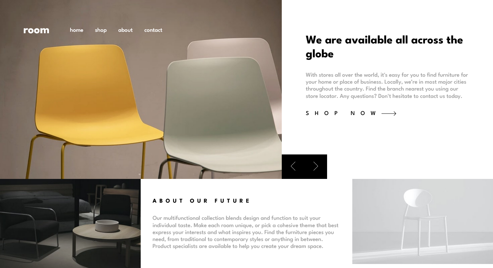

# Frontend Mentor - Room homepage solution

This is a solution to the [Room homepage challenge on Frontend Mentor](https://www.frontendmentor.io/challenges/room-homepage-BtdBY_ENq). Frontend Mentor challenges help you improve your coding skills by building realistic projects. 

## Table of contents

- [Frontend Mentor - Room homepage solution](#frontend-mentor---room-homepage-solution)
  - [Table of contents](#table-of-contents)
  - [Overview](#overview)
    - [The challenge](#the-challenge)
    - [Screenshot](#screenshot)
    - [Links](#links)
  - [My process](#my-process)
    - [Built with](#built-with)
    - [Continued development](#continued-development)
    - [Useful resources](#useful-resources)
  - [Author](#author)

## Overview

### The challenge

Users should be able to:

- View the optimal layout for the site depending on their device's screen size
- See hover states for all interactive elements on the page
- Navigate the slider using either their mouse/trackpad or keyboard

### Screenshot

### Links

- Solution URL: [My Solution](https://github.com/Dla2/ROOM-HOMEPAGE-MASTER.git)
- Live Site URL: [Live Site](https://your-live-site-url.com)

## My process

### Built with

- Semantic HTML5 markup
- CSS custom properties
- Flexbox
- CSS Grid
- Mobile-first workflow
- [VueJs](https://vuejs.org) - JS library

### Continued development
For continued development I would like to make this website feel less slow and clunky, make the layout and code look cleaner

### Useful resources

- [Example resource 1](https://vuejs.org) -This helped with some of the parts of the VueJs framework I not fully familiar with

## Author

- Frontend Mentor - [Dla2](https://www.frontendmentor.io/profile/Dla2)
- Twitter - [sentetechdev](https://twitter.com/sentetechdev)
